# 6

## Порождающие шаблоны

### Абстрактная фабрика (Abstract Factory)

Паттерн Abstract Factory предоставляет общий интерфейс для создания семейства взаимосвязанных объектов. Это позволяет отделить функциональность системы от внутренней реализации каждого класса, а обращение к этим классам становится возможным через абстрактные интерфейсы.

```go
type AbstractFactory interface {
    CreateReportMSFO() AbstractReportMSFO
    CreateReportRSBU() AbstractReportRSBU
}

type AbstractReportMSFO interface {
    getCommonInformation() CommonInformation
}

type AbstractReportRSBU interface {
    getCommonInformation() CommonInformation
}

// Реализация AbstractFactory
type ReportFactory struct {
}

// Конструктор ReportFactory
func NewReportFactory() ReportFactory {
    return &ReportFactory{}
}


func (r *ReportFactory) CreateReportMSFO() AbstractReportMSFO {
    return &AbstractReportMSFO{}
}


func (r *ReportFactory) CreateReportRSBU() AbstractReportRSBU {
    return &AbstractReportRSBU{}
}


// Реализация AbstractReportMSFO
type ReportMSFO struct {
    commonInformation CommonInformation
}

func (r *ReportMSFO) getCommonInformation() CommonInformation {
    return r.commonInformation
}


// Реализация AbstractReportRSBU
type ReportRSBU struct {
    CommonInformation CommonInformation
}

func (r *ReportRSBU) getCommonInformation() CommonInformation {
    return r.commonInformation
}
```

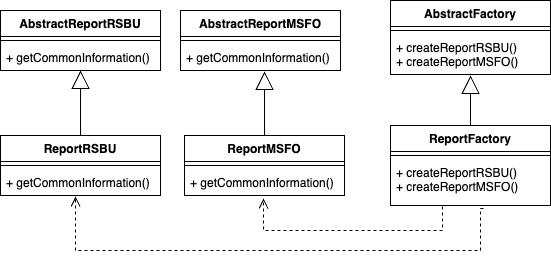

### Строитель (Builder)

Паттерн Builder определяет процесс поэтапного построения сложного продукта. После того как будет построена последняя его часть, продукт можно использовать.

```golang

type LiabilitiesBuilder interface {
    MakeCapital(val float64)
    MakeNonCurrent(val float64)
    MakeСurrent(val float64)
}

type Director struct {
    liabilitiesBuilder LiabilitiesBuilder
}

func (d *Director) Construct() {
    d.liabilitiesBuilder.MakeCapital()
    d.liabilitiesBuilder.MakeNonCurrent()
    d.liabilitiesBuilder.MakeСurrent()
}

type ConcreteLiabilitiesBuilder struct {
    liabilities *Liabilities
}

func (l *ConcreteLiabilitiesBuilder) MakeCapital(val float64) {
    l.liabilities.authoriseвСapital += val
    l.liabilities.totalLiabilities += val
}

func (l *ConcreteLiabilitiesBuilder) MakeNonCurrent(val float64) {
    l.liabilities.nonCurrentLoans += val
    l.liabilities.totalLiabilities += val
}

func (l *ConcreteLiabilitiesBuilder) MakeСurrent(val float64) {
    l.liabilities.currentLoans += val
    l.liabilities.totalLiabilities += val
}

type Liabilities struct {
    authoriseвСapital float64
    nonCurrentLoans float64
    currentLoans float64
    totalLiabilities float64
}

func (l *Liabilities) getTotalLiabilities() float64 {
    return l.totalLiabilities
}
```

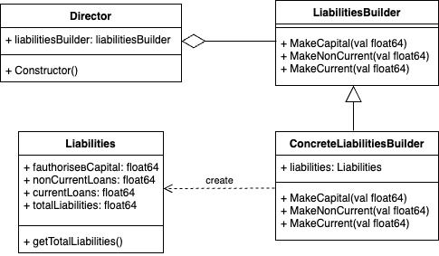

### Одиночка (Singleton)

Паттерн Singleton относится к порождающим паттернам уровня объекта. Паттерн контролирует создание единственного экземпляра некоторого класса и предоставляет доступ к нему. Другими словами, Singleton гарантирует, что у класса будет только один экземпляр и предоставляет к нему точку доступа, через фабричный метод.

```golang
type DatabaseService struct {
    connection string
}

var (
    dbService     *DatabaseService
    dbServiceOnce sync.Once
)

func GetDatabaseService() *DatabaseService {
    dbServiceOnce.Do(func() {
        dbService = &DatabaseService{
            connection: "dummy connection"
        }
    })
    return dbService
}
```

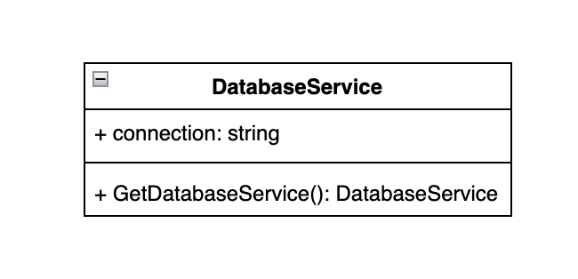

## Структурные шаблоны

### Адаптер (Adapter)

Смысл работы этого паттерна в том, что если у вас есть класс и его интерфейс не совместим с кодом вашей системы, то что бы разрешить этот конфликт, мы не изменяем код этого класса, а пишем для него адаптер. Другими словами Adapter адаптирует существующий код к требуемому интерфейсу (является переходником).

```golang
// интерфейс с которым система должна работать
type NewReport interface {
    GetTotalInformation() string
}

// адаптируемый класс
type OldReport struct {
}

// коструктора адаптора
func NewAdapter(adaptee *OldReport) NewReport {
    return &Adapter{adaptee}
}

// реализация метода адаптируемого класса
func (a *OldReport) GetInformation() string {
    return "total information"
}

type Adapter struct {
    *OldReport
}

// адаптация метода
func (a *Adapter) GetTotalInformation() string {
    return a.GetInformation()
}
```

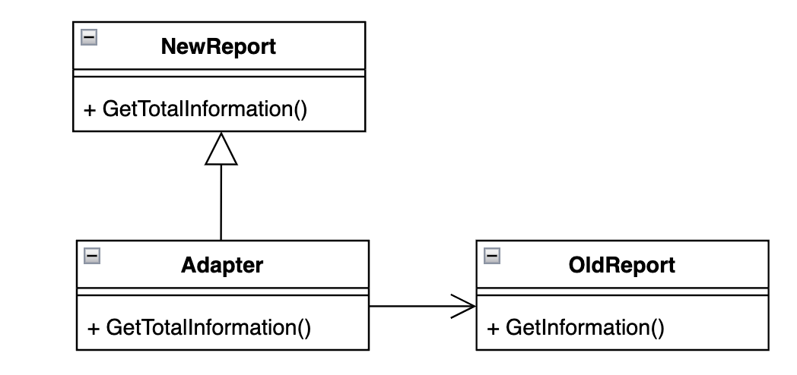

### Мост (Bridge)

Паттерн Bridge позволяет разделить объект на абстракцию и реализацию так, чтобы они могли изменяться независимо друг от друга.

```golang
type Report interface {
    getLiabilities() string
}

type AbstractReport struct {
    report Report
}

func AbstractReport(report Report) AbstractReport{
    return &Abstract{
        report: report
    }
}

func (c *Report) getLiabilities() float64 {
    return c.engine.getLiabilities()
}

type RSBUReport struct {
    liabilities float64
}

func (r *RSBUReport) getLiabilities() float64 {
    return r.liabilities
}
}

type MSFOReport struct {
    liabilities float64
}

func (r *MSFOReport) getLiabilities() float64 {
    return r.liabilities
}
```

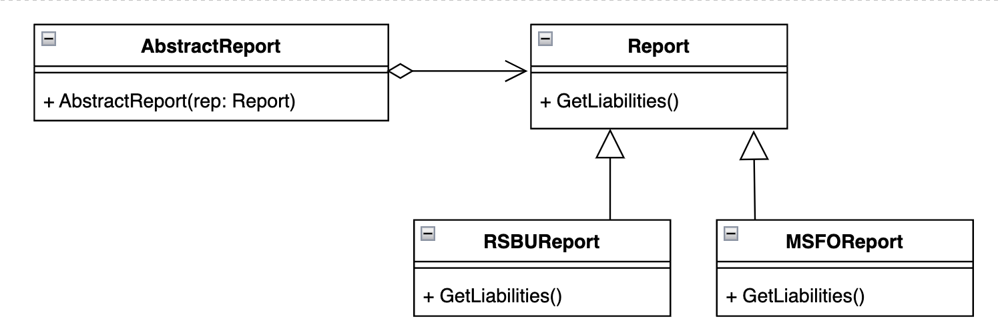

### Компоновщик (Composite)

Паттерн Composite группирует схожие объекты в древовидные структуры.

```golang
type Report interface {
    Add(child Report)
    Total() float64
    Child() []Report
    Display(prefix string) string
}

type ReportCollection struct {
    total   float64
    childs []Report
}

func (c *ReportCollection) Add(child Report) {
    c.childs = append(c.childs, child)
}

func (c *ReportCollection) Total() float64 {
    return c.total
}

func (c *ReportCollection) Child() []Report {
    return c.childs
}

func (c *ReportCollection) Display() float64 {
    result := c.Total() 
    for _, val := range c.Child() {
        result += c.Total()
    }
    return result
}

type RSBUReport struct {
    total float64
}

func (r *RSBUReport) Total() float64 {
    return r.total
}

func (r *RSBUReport) Dispay() float64 {
    return r
}

func NewReportCollection(value float64) *ReportCollection {
    return &ReportCollection{
        total: value,
    }
}

func NewRSBUReport(value float64) *RSBUReport {
    return &RSBUReport{
        total: value
    }
}
```

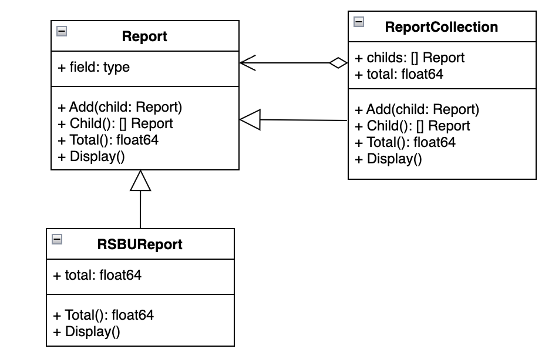

### Декоратор (Decorator)

Паттерн Decorator используется для расширения функциональности объектов путем динамического добавления объекту новых возможностей. При реализации паттерна используется отношение композиции.

```golang
type Report interface {
    getTotalLiabilities() float64
}

type MSFOReport struct {
}

func (r *MSFOReport) getTotalLiabilities() float64 {
    return r.totalLiabilities
}

type ReportDecorator interface{
    getTotalLiabilities()
}

type MSFOReportDecorator struct{
    report Report
}

func (d *MSFOReportDecorator) getTotalLiabilities() string {
    // декорирующий функционал
    return d.report.getTotalLiabilities()
}
```

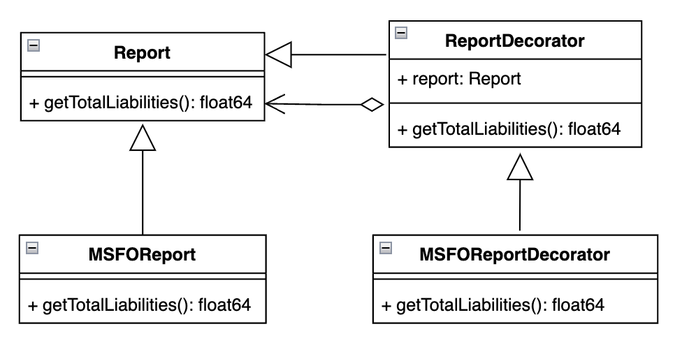

## Поведенческие шаблоны

### Команда (Command)

Паттерн Command позволяет представить запрос в виде объекта. Из этого следует, что команда - это объект. Такие запросы, например, можно ставить в очередь, отменять или возобновлять.

```golang
type Command interface {
    Execute()
}

type ReportCommandContext struct {
    command Command
}

func (rcc *ReportCommandContext) SetCommand(command Command) {
    rcc.command = command
}

func (rcc *ReportCommandContext) Run() {
    rcc.command.Execute()
}

type GenerateReportCommand struct{}

func (grc *GenerateReportCommand) Execute() {
    fmt.Println("Генерация отчета...")
}

type SendReportCommand struct{}

func (src *SendReportCommand) Execute() {
    fmt.Println("Отправка отчета...")
}

type RollbackReportCommand struct{}

func (rrc *RollbackReportCommand) Execute() {
    fmt.Println("Откат отчета...")
}
```

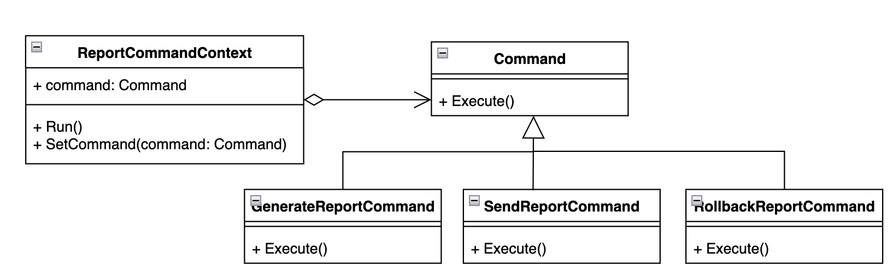

### Итератор (Iterator)

Паттерн Iterator предоставляет механизм обхода коллекций объектов не раскрывая их внутреннего представления.

```golang
type Iterator interface {
    Index() int
    Value() interface{}
    Has() bool
    Next()
    Prev()
    Reset()
    End()
}

type Aggregate interface {
    Iterator() Iterator
}

type ReportIterator struct {
    collection    *ReportCollection
    index    int
    internal int
}

func (r *ReportIterator) Index() int {
    return r.index
}

func (r *ReportIterator) Value() interface{} {
    return r.collection.Reports[r.index]
}

func (r *ReportIterator) Has() bool {
    if r.internal < 0 || r.internal >= len(r.collection.Reports) {
        return false
    }
    return true
}

func (r *ReportIterator) Next() {
    r.internal++
    if r.Has() {
        r.index++
    }
}

func (r *ReportIterator) Prev() {
    r.internal--
    if r.Has() {
        r.index--
    }
}

func (r *ReportIterator) Reset() {
    r.index = 0
    r.internal = 0
}

func (r *ReportIterator) End() {
    r.index = len(r.collection.Reports) - 1
    r.internal = r.index
}

type ReportCollection struct {
    Reports []*Report
}

func (r *ReportCollection) Iterator() Iterator {
    return &ReportIterator{collection: r}
}

func (r *ReportCollection) Add(report *Report) {
    r.Reports = append(r.Reports, report)
}

type Report struct {
    Name string
}
```

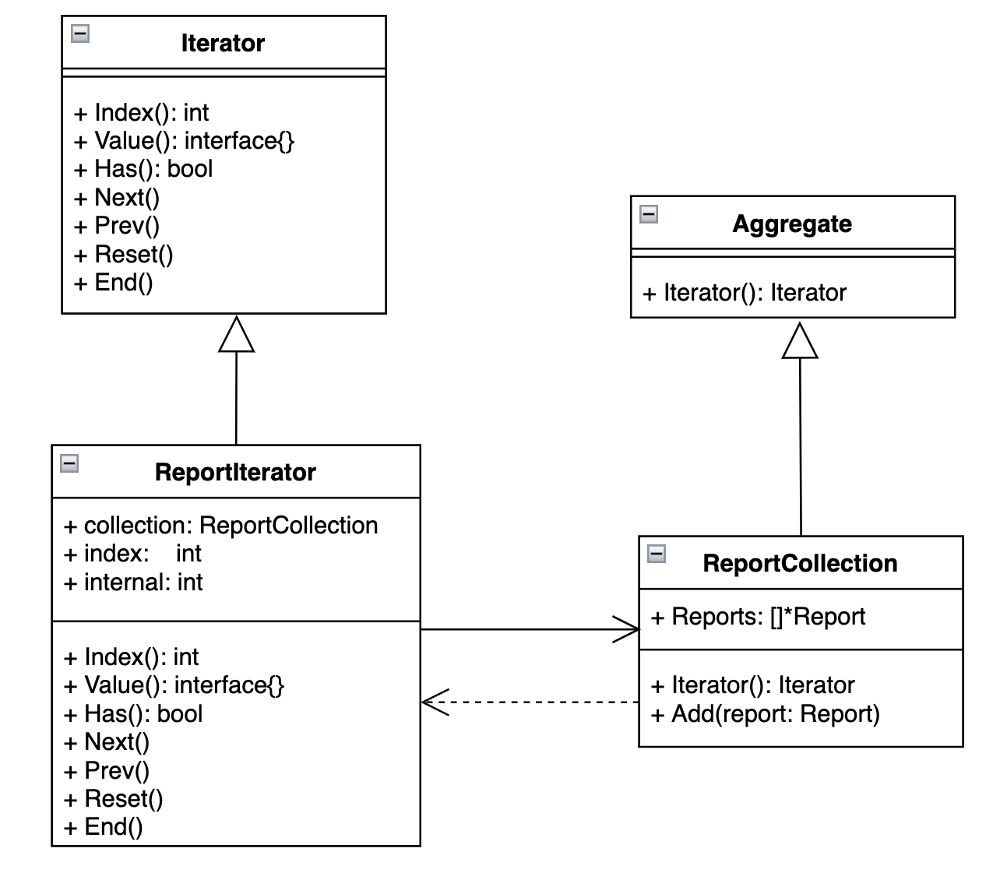

### Состояние (State)

Паттерн State позволяет объекту изменять свое поведение в зависимости от внутреннего состояния и является объектно-ориентированной реализацией конечного автомата. Поведение объекта изменяется настолько, что создается впечатление, будто изменился класс объекта.

```golang
type State interface {
    Handle()
}

type ReportContext struct {
    state State
}

func (rc *ReportContext) SetState(state State) {
    rc.state = state
}

func (rc *ReportContext) Generate() {
    rc.state.Handle()
}

type InProcessState struct{}

func (ips *InProcessState) Handle() {
    fmt.Println("Отчет находится в процессе генерации...")
}

type ReadyState struct{}

func (rs *ReadyState) Handle() {
    fmt.Println("Отчет готов к отправке.")
}

type SentState struct{}

func (ss *SentState) Handle() {
    fmt.Println("Отчет отправлен.")
}
```

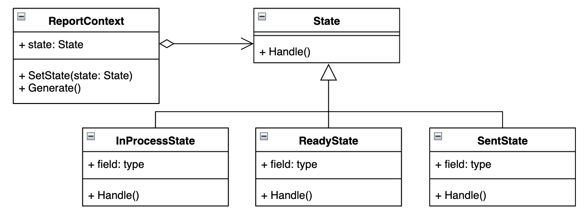

### Шаблонный метод (Template Method)

Паттерн Template Method формирует структуру алгоритма и позволяет в производных классах реализовать, перекрыть или переопределить определенные шаги алгоритма, не изменяя структуру алгоритма в целом.

```golang
type Report interface {
    PrepareData()
    PrintReport()
}

type BaseReport struct {}

func (r *BaseReport) PrepareData() {
    //подготавливает данные для отчета
}

func (r *BaseReport) PrintReport() {
    //выводит отчет
}

func (r *BaseReport) Generate() {
    r.PrepareData()
    r.PrintReport()
}

type IncomeStatementReport struct {
    BaseReport
}

func (b *IncomeStatementReport) PrepareData() {
    // доп логика форматирования
}

func (b *IncomeStatementReport) PrintReport() {
    // доп логика форматирования
}

type BalanceReport struct {
    BaseReport
}

func (b *BalanceReport) PrepareData() {
    // доп логика форматирования
}

func (b *BalanceReport) PrintReport() {
    // доп логика форматирования
}
```

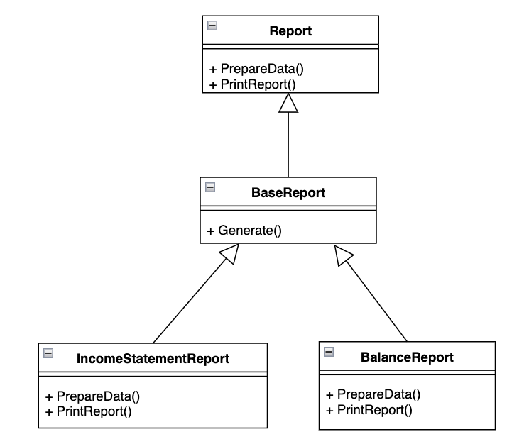

### Посетитель (Visitor)

Паттерн Visitor позволяет обойти набор элементов (объектов) с разнородными интерфейсами, а также позволяет добавить новый метод в класс объекта, при этом, не изменяя сам класс этого объекта.

```golang
type Element interface {
    Accept(visitor Visitor)
}

type ReportElement struct {
    Name string
}

func (re *ReportElement) Accept(visitor Visitor) {
    visitor.VisitElement(re)
}

type Row struct {
    ReportElement
}

type Column struct {
    ReportElement
}

type Visitor interface {
    VisitElement(element Element)
    VisitRow(row *Row)
    VisitColumn(column *Column)
    VisitCell(cell *Cell)
}

type AnalyzerVisitor struct{}

func (av *AnalyzerVisitor) VisitElement(element Element) {
    fmt.Println("Анализ элемента:", element)
}

func (av *AnalyzerVisitor) VisitRow(row *Row) {
    fmt.Println("Анализ строки:", row.Name)
}

func (av *AnalyzerVisitor) VisitColumn(column *Column) {
    fmt.Println("Анализ колонки:", column.Name)
}
```

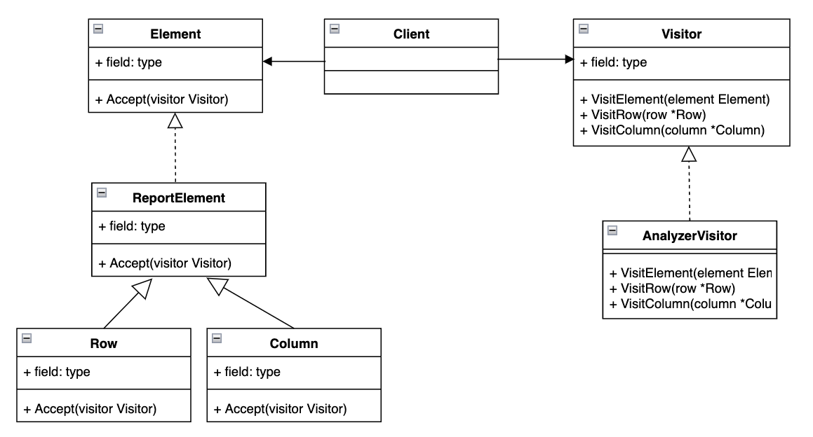

## GRASP

### 5 ролей (обязанностей) классов

#### Information Expert

Проблема: информация в системе должна обрабатываться, аккумулироваться, рассчитываться и т.п.
Решение: назначить соответствующие обязанности тому классу, который содержит информацию

Пример:

```golang
type ReportCollection struct {
    total   float64
    childs []Report
}

func (c *ReportCollection) Total() float64 {
    return c.total
}
```

Результаты: Соблюдается принцип инкапсуляции, уменьшается связанность классов
Связь с другими паттернами: Model (в MVC), объект предметной области

#### Creator

Проблема: экземпляры класса необходимо создавать
Решение: назначить обязанности инстанциирования тому классу, который будет
использовать соответствующие экземпляры созданных классов

Пример:

```golang
type AbstractFactory interface {
    CreateReportMSFO() AbstractReportMSFO
    CreateReportRSBU() AbstractReportRSBU
}

type AbstractReportMSFO interface {
    getCommonInformation() CommonInformation
}

type AbstractReportRSBU interface {
    getCommonInformation() CommonInformation
}

// Реализация AbstractFactory
type ReportFactory struct {
}

// Конструктор ReportFactory
func NewReportFactory() ReportFactory {
    return &ReportFactory{}
}


func (r *ReportFactory) CreateReportMSFO() AbstractReportMSFO {
    return &AbstractReportMSFO{}
}


func (r *ReportFactory) CreateReportRSBU() AbstractReportRSBU {
    return &AbstractReportRSBU{}
}


// Реализация AbstractReportMSFO
type ReportMSFO struct {
    commonInformation CommonInformation
}

func (r *ReportMSFO) getCommonInformation() CommonInformation {
    return r.commonInformation
}


// Реализация AbstractReportRSBU
type ReportRSBU struct {
    CommonInformation CommonInformation
}

func (r *ReportRSBU) getCommonInformation() CommonInformation {
    return r.commonInformation
}
```

Результаты: Соблюдается принцип инкапсуляции, уменьшается связанность классов
Связь с другими паттернами: антипаттерн Poltergeist, Abstract Factory

#### Controller

Проблема: необходимо обрабатывать входные системные события
Решение: назначить обязанность обработки входных системных событий специальному классу (внешний контроллер или контроллеры прецедентов)
Пример:

```golang
type FinancialReport struct {
	ID   int
	Name string
	// поля отчета...
}

type FavoriteReportsService struct {
	favoriteReports []*FinancialReport
}

func (frs *FavoriteReportsService) AddToFavorite(report *FinancialReport) {
	frs.favoriteReports = append(frs.favoriteReports, report)
	fmt.Printf("Отчет '%s' добавлен в избранное.\n", report.Name)
}

type FavoriteReportsController struct {
	ReportsService *FavoriteReportsService
}

func NewFavoriteReportsController(reportsService *FavoriteReportsService) *FavoriteReportsController {
	return &FavoriteReportsController{
		ReportsService: reportsService,
	}
}

func (frc *FavoriteReportsController) AddToFavorite(report *FinancialReport) {
	frc.ReportsService.AddToFavorite(report)
}

func main() {
	// сервис избранных отчетов
	favoriteReportsService := &FavoriteReportsService{}

	// контроллер избранных отчетов
	favoriteReportsController := NewFavoriteReportsController(favoriteReportsService)

	// создаем финансовый отчет компании
	financialReport := &FinancialReport{
		ID:   1,
		Name: "Финансовый отчет компании A",
		// поля отчета...
	}

	// добавляем отчет в избранное с помощью контроллера
	favoriteReportsController.AddToFavorite(financialReport)
}
```

Результаты: В бизнес-логике нет многопоточности
Связь с другими паттернами:

#### Pure Fabrication

Проблема: необходимо обеспечивать Low Coupling и High Cohesion
Решение: синтезировать искусственную сущность для обеспечения Low Coupling и
High Cohesion

Пример:

```golang
type DateParser struct{}

type DateParser interface{
    ParseDateFromString(dateStr string) (time.Time, error)
}

func (dp *DateParser) ParseDateFromString(dateStr string) (time.Time, error) {
	dateFormat := "02.01.2006" // формат дд.мм.гггг

	// парсим строку в формат time.Time
	parsedDate, err := time.Parse(dateFormat, dateStr)
	if err != nil {
		return time.Time{}, err
	}

	return parsedDate, nil
}
```

Результаты: Бизнес-логика не смешивается с логикой приложения, на уровне архитектуры
лучше поддерживаются Low Coupling и High Cohesion

#### Indirection

Проблема:  необходимо распределить обязанности объектов, избежав прямого связывания
Решение: присвоить обязанности по обеспечению связи между компонентами или службами промежуточному объекту

Пример: Использование интерфейсов и абстрактных классов уже добавляет промежуточный уровень индирекции.
Например, интерфейсов LiabilitiesBuilder и Visitor.

```golang
type Visitor interface {
    VisitElement(element Element)
    VisitRow(row *Row)
    VisitColumn(column *Column)
    VisitCell(cell *Cell)
}

type LiabilitiesBuilder interface {
    MakeCapital(val float64)
    MakeNonCurrent(val float64)
    MakeСurrent(val float64)
}
```

Результаты: Заменяемость частей системы, возможность их повторного использования
Связь с другими паттернами: похож на Dependency Inversion Principle в SOLID

### 3 принципа разработки

#### Polymorphism

Проблема: необходимо обрабатывать различные варианты поведения на основании типа, допуская замену частей системы
Решение: распределить обязанности между классами с использованием полиморфных операций, оставив каждой внешней системе свой интерфейс

Пример:

```golang
type Report interface {
    PrepareData()
    PrintReport()
}

type BaseReport struct {}

func (r *BaseReport) PrepareData() {
    //подготавливает данные для отчета
}

func (r *BaseReport) PrintReport() {
    //выводит отчет
}

func (r *BaseReport) Generate() {
    r.PrepareData()
    r.PrintReport()
}

type IncomeStatementReport struct {
    BaseReport
}

func (b *IncomeStatementReport) PrepareData() {
    // доп логика форматирования
}

func (b *IncomeStatementReport) PrintReport() {
    // доп логика форматирования
}

type BalanceReport struct {
    BaseReport
}

func (b *BalanceReport) PrepareData() {
    // доп логика форматирования
}

func (b *BalanceReport) PrintReport() {
    // доп логика форматирования
}
```

Результаты: Подключаемые компоненты системы будут заменяемыми

#### Low Coupling

Проблема: необходимо обеспечивать низкую связанность между классами
Решение: распределить обязанности так, чтобы степень связанности оставалась
низкой

Пример: Классы в этом коде имеют низкую связность. Например, LiabilitiesBuilder независим от конкретных реализаций Liabilities.

Результаты:

- Отсутствует необходимость согласованных изменений классов
- Классы становятся более пригодны для повторного использования
- Классы более легко поддерживать

#### High Cohesion

Проблема:  необходимо обеспечивать выполнение объектами разнородных функций
Решение: распределить обязанность так, чтобы обеспечить высокое зацепление
низкой

Пример: Классы ReportFactory, ReportMSFO, ReportRSBU, LiabilitiesBuilder и ConcreteLiabilitiesBuilder обладают высокой сцепленностью, поскольку каждый из них отвечает только за свои задачи.

Результаты:

- Несколько контекстов смешивается в одном классе
- Классы более легко поддерживать
Связь с другими паттернами: похож на Single Responsibility Principle в SOLID

### свойство программы

#### Protected Variations

Проблема: необходимо спроектировать систему так, чтобы изменение одних её элементов не влияло на другие
Решение: идентифицировать точки возможных изменений или неустойчивости и распределить обязанности так, чтобы обеспечить устойчивую работу системы

Пример: Использование интерфейсов и абстрактных классов позволяет изолировать изменения в реализации от кода, который их использует.

```golang
type DatabaseService struct {
    connection string
}

var (
    dbService     *DatabaseService
    dbServiceOnce sync.Once
)

func GetDatabaseService() *DatabaseService {
    dbServiceOnce.Do(func() {
        dbService = &DatabaseService{
            connection: "dummy connection"
        }
    })
    return dbService
}
```

Результаты: Внося изменения в одни части программы нет необходимости изменять другие
части программы
Связь с другими паттернами: похож на Open Closed Principle в SOLID