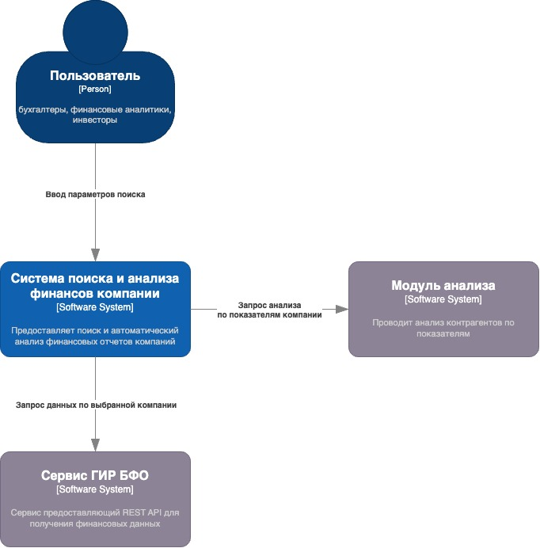
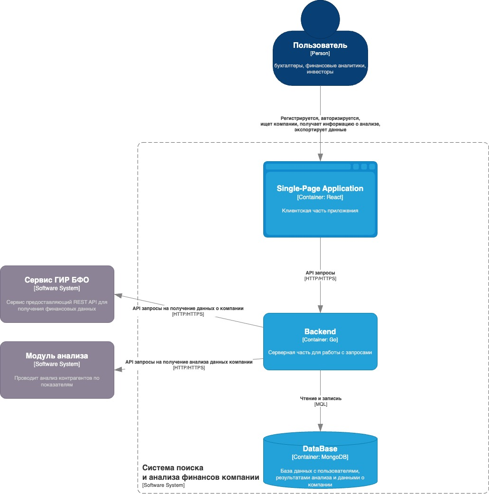

# Лабораторная работа 2

## Диаграмма системного контекста
Описано взаимодействие системы с внешними системами.

## Диаграмма контейнеров
В качестве базового стиля была выбранная клиент-серверная архитектура. система состоит из следующих контейнеров: клиентской части, серверной и базы данных.

## Диаграмма компонентов
Данная диграмма компонентов описывает серверную часть системы. Используется архитекура на основе сервисов с монолитной базой данных.

