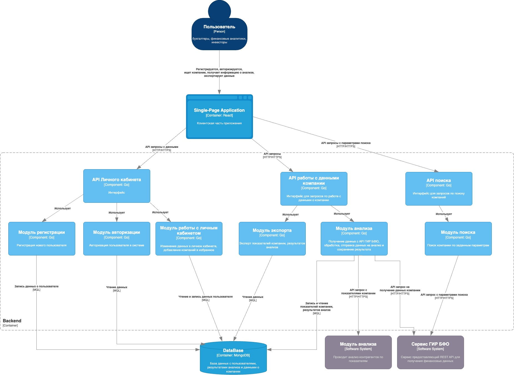
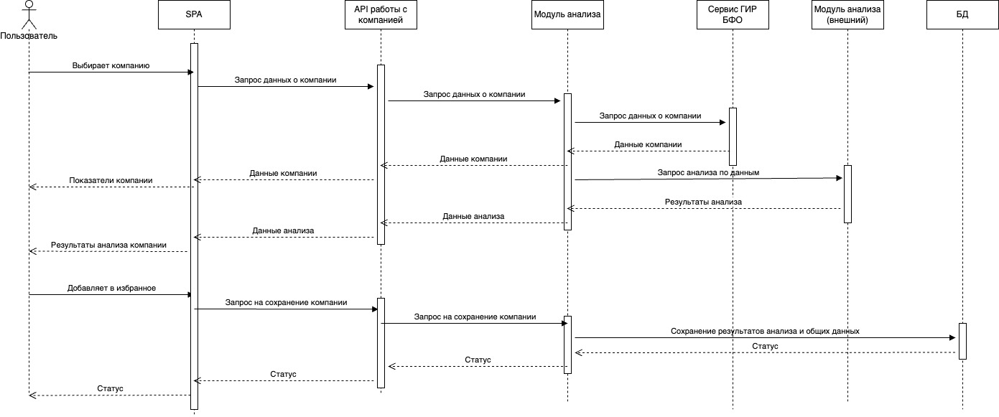
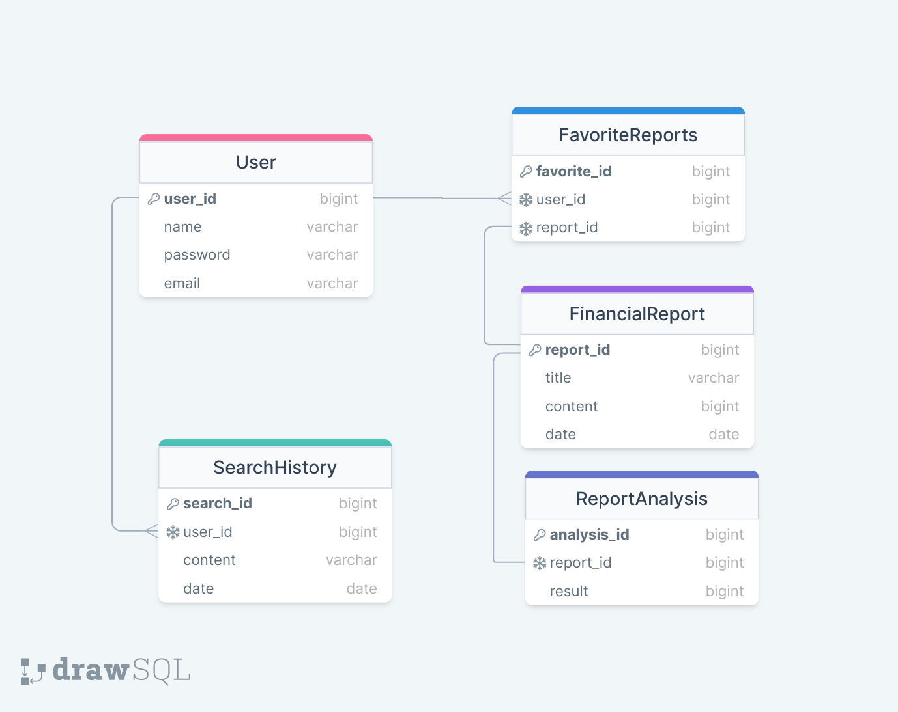

# Работ 3

## Диаграмма компонентов

Из данной диаграммы используется следующая часть(компонет) "API работы с данными компании" и "Модуль анализа".

## Диаграмма последовательностей

Диаграмма последовательности для прецедентов "Просмотр основной информации о финансах компании", "Просмотр результатов анализа", "Сохранение компании в избранное"

## Модель БД

Модель данных имеет 5 основных сущностей: Пользователь, ИзбранныеОчтеты, ФинансовыеОтчеты, АнализОтчетов и ИсторияПоиска

## Применение основных принципов разработки

Используем принципы DRY, KISS, YAGNI в клиентской части приложения, а SOLID в серверной

### KISS

KISS призывает к тому, чтобы решения были максимально простыми.

Данный принип соблюдается в структуре компонентов и слайсов Redux. Компоненты имеют ясные и простые обязанности. Например, отдельно есть `CompanyItem` и `CompanyList`, который использует его, они отвечают только за отображение списка. Redux слайс `companyTotalInformation.slice` также прост в реализации, в нем для каждого matcher написана своя короткая реализация.

Вот так в общем этот принцип применяется:

- Каждый компонент и хук отвечают за свою конкретную задачу.
- Более болшие компоненты, модули и страницы использует более мелкие компоненты, модули и хуки для упрощения структуры.

### YAGNI

YAGNI предполагает, что не следует внедрять функциональность, которая не требуется на данный момент.

Данный принип соблюдается в том, что компоненты и логика ограничиваются минимальным набором функций, не внедряя избыточные возможности. Например, используются только те, которые необходимы для отображения информации о компании в `CompanyTotalInformation`.

### DRY

DRY подразумевает, что каждая часть знания или логики должна существовать в единственном экземпляре.

- Например в __**companyTotalInformation.api.slice**__ экспортируем `useGetCompanyDataQuery`. Этот хук инкапсулирует логику выполнения запроса к API для получения данных о компании. Таким образом, повторяющийся код для обработки запросов вынесен в отдельный хук, мы можем его везде переиспользовать.

### SOLID

#### Принцип единственной ответственности (SRP)

`database/database.go`:

- `DatabaseHandler` имеет единственную ответственность - обеспечение методов для работы с базой данных.

`service/service.go`:

- `CompanyService` занимается только бизнес-логикой, связанной с компаниями.

`api/api.go`:

- `CompanyAPI` отвечает за обработку запросов API.

Каждый компонент обладает четко определенной ответственностью, что делает код более понятным и легким в поддержке.

#### Принцип открытости/закрытости (OCP)

`database/database.go`:

- Интерфейс `DatabaseHandler` предоставляет возможность расширения функционала без изменения существующего кода.

`service/service.go`:

- Аналогично интерфейс `CompanyService`

#### Принцип подстановки Барбары Лисков (LSP)

`database/database.go`:

- Все структуры, реализующие `DatabaseHandler`, могут быть использованы вместо друг друга без изменения поведения.

`service/service.go`:

- То же самое касается структур, реализующих `CompanyService`.

Поведение можно ожидать от любой реализации интерфейса, что обеспечивает взаимозаменяемость компонентов.

#### Принцип разделения интерфейса (ISP)

`database/database.go`:

- Интерфейс `DatabaseHandler` содержит только методы, необходимые для работы с базой данных.

`service/service.go`:

- Аналогично интерфейс `CompanyService` содержит только методы, связанные с компаниями.

#### Принцип инверсии зависимостей (DIP)

Зависимости внедряются через интерфейсы, делая компоненты менее связанными и более гибкими.

`main.go`:
В главном файле создаются экземпляры структур, реализующих интерфейсы (DatabaseHandler, CompanyService), и передаются зависимостями в структуры, которые их используют.

## Дополнительные принципы разработки

### BDUF (Big Design Up Front)

Эта методология, при которой весь проект, или его значительная часть, проектируется и документируется до начала активной разработки. Для создания сервиса в рамках ВКР данный подход не совсем уместен, так как мы ограниченны по времени и ресурсам.

### SoC (Separation of Concerns)

Это принцип, согласно которому программа разделяется на части (модули, классы, компоненты), каждая из которых отвечает за конкретный аспект функциональности.

Данный принцип уже соблюдается при проектировании архитектуры системы и написании кода.

### MVP (Minimum Viable Product)

Это версия продукта, содержащая минимальный набор функций, необходимых для его внедрения.

Данный принцип очень хорошо подходит в рамках нашего проекта, так как это ВКР. Это позволит быстро создать продукт, внедрить и защитить его.

### PoC (Proof of Concept)

PoC - это доказательство концепции, обычно небольшой итерации, направленной на проверку жизнеспособности и эффективности определенного подхода или технологии.

Имеет место быть в начале разработки, чтобы определиться со многими вещами, но в рамках данного проекта не стоит использовать регулярное, а также зацикливаться на эффективности, которая может расти несоразмерно с затраченным временем.