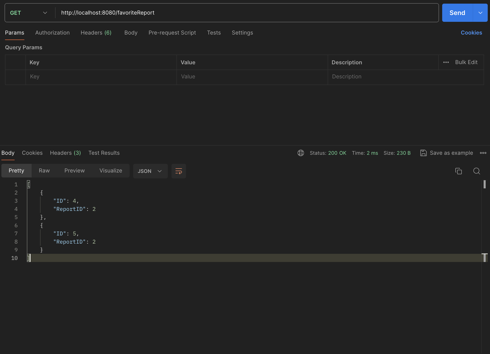

# Лабораторная работа 4
## Описание 

Здесь описаны основные методы API для работы пользователя с компаниями и их финансовыми отчетами. 

Для упрощения все методы указаны без авторизации. Предполагается, что пользователь авторизован.

## История поиска

Здесь описаны 5 методов для взаимодействия с историей поиска.

<br>

### GetAllSeacrhHistory

**Описание:** 

Получение списка всех элементов из истории поиска

**Метод:** GET

**Входные параметры:** НЕТ

**Пример ответа:**

```json
[
    {
        "ID": 4,
        "Content": "ad",
        "Date": "2023-10-20T00:00:00Z"
    },
    {
        "ID": 5,
        "Content": "asd",
        "Date": "2023-10-20T00:00:00Z"
    },
    {
        "ID": 6,
        "Content": "asdad",
        "Date": "2023-10-20T00:00:00Z"
    }
]
```

**URL:**
```
GET https://{adress}/searchHistories
```

<br>

### GetSearchHistoryByID

**Описание:** 

Получение элемента истории поиска по id

**Метод:** GET

**Входные параметры:**
| Параметр  | Тип    | Описание    |
|-----------|--------|-------------|
| id | int | идентификатор записи |


**Пример ответа:**

```json
{
    "ID": 6,
    "Content": "asdad",
    "Date": "2023-10-20T00:00:00Z"
}
```

**URL:**
```
GET https://{adress}/searchHistories/id
```

<br>

### CreateSearchHistory

**Описание:** 

Добавление нового элемента истории

**Метод:** POST

**Входные параметры:**
| Параметр  | Тип    | Описание    |
|-----------|--------|-------------|
| content | string | содержимое |
|date|   string     |        дата обращения     |

**Пример запроса:**
```json
{
    "content": "Яндекс",
    "date": "20.10.2023"
}
```

**Пример ответа:** 
```json
{
    "ID": 10,
    "Content": "Яндекс",
    "Date": "2023-10-20T00:00:00Z"
}
```

**URL:**
```
POST https://{adress}/searchHistory
```

<br>

### UpdateSearchHistory

**Описание:** 

Изменяет имеющуюся историю.

**Метод:** PUT

**Входные параметры:**
| Параметр  | Тип    | Описание    |
|-----------|--------|-------------|
| id | int | id записи истории |
|content|   string     |        контент истории     |
|date | string| Дата обращения |

**Пример запроса:**
```json
{
    "id": 4,
    "content": "ad",
    "date": "20.10.2023"
}
```

**Пример ответа:**
```json
{
    "succes": "SearchHistory item updated"
}
```
**URL:**
```
PUT https://{adress}/searchHistory
```

<br>

### DeleteSearchHistory

**Описание:** 

Удаляет запись истории, если она есть.

**Метод:** DELETE

**Входные параметры:**
| Параметр  | Тип    | Описание    |
|-----------|--------|-------------|
| id | int | идентификатор записи истории |

**Пример ответа:** НЕТ
```json
{
    "succes": "SearchHistory item deleted",
}
```

**URL:**
```
DELETE https://{adress}/searchHistory/id
```

<br>

## Избранные компании

Здесь описаны 5 методов для взаимодействия с избранными компаниями.

<br>

### GetAllFavoriteReports

**Описание:** 

Получение списка всех избранных компаний

**Метод:** GET

**Входные параметры:** НЕТ

**Пример ответа:**

```json
[
    {
        "ID": 4,
        "ReportID": 2
    },
    {
        "ID": 5,
        "ReportID": 2
    }
]
```

**URL:**
```
GET https://{adress}/favoriteReport
```

### GetFavoriteReportByID

**Описание:** 

Получение компании из избранног по идентификатору

**Метод:** GET

**Входные параметры:**
| Параметр  | Тип    | Описание    |
|-----------|--------|-------------|
| id | int | идентификатор записи |

**Пример ответа:**

```json
{
    "ID": 4,
    "ReportID": 2
}
```

**URL:**
```
GET https://{adress}/favoriteReport/id
```

<br>

### CreateFavoriteReport

**Описание:** 

Добавление компании в избранное

**Метод:** POST

**Входные параметры:**
| Параметр  | Тип    | Описание                             |
|-----------|--------|--------------------------------------|
| reportId | int | идентификатор компании                |

```json
{
    "reportId": 3
}
```

**Пример ответа:** 

```json
{
    "ID": 6,
    "ReportID": 3
}
```

**URL:**
```
POST https://{adress}/favoriteReport
```

<br>

### UpdateFavoriteReport

**Описание:** 

Изменяем компанию в избранном

**Метод:** PUT

**Входные параметры:**
| Параметр  | Тип    | Описание                             |
|-----------|--------|--------------------------------------|
| id | int | идентификатор избранного                |
| reportId | int | идентификатор компании                |

```json
{
    "id": 6,
    "reportId": 2
}
```

**Пример ответа:**
```json
{
    "succes": "FavoriteReport item updated"
}
```

**URL:**
```
PUT https://{adress}/favoriteReport
```

<br>

### DeleteFavoriteReport

**Описание:** 

Удаляет компанию из избранного.

**Метод:** DELETE

**Входные параметры:**
|  Параметр  | Тип    | Описание   |
|------------|--------|------------|
|  id  |  int  | id записи из избранного  |

**Пример ответа:**
```json
{
    "succes": "FavoriteReport item deleted"
}
```

**URL:**
```
DELETE https://{adress}/favoriteReport/id
```

<br>

## Тестирование Postman

### GetAllSeacrhHistory


<br>

### GetSearchHistoryByID


<br>

### CreateSearchHistory


<br>

### UpdateSearchHistory


<br>

### DeleteSearchHistory


<br>

### GetAllFavoriteReports




<br>

### GetFavoriteReportByID


<br>

### CreateFavoriteReport


<br>

### UpdateFavoriteReport


<br>

### DeleteFavoriteReport


