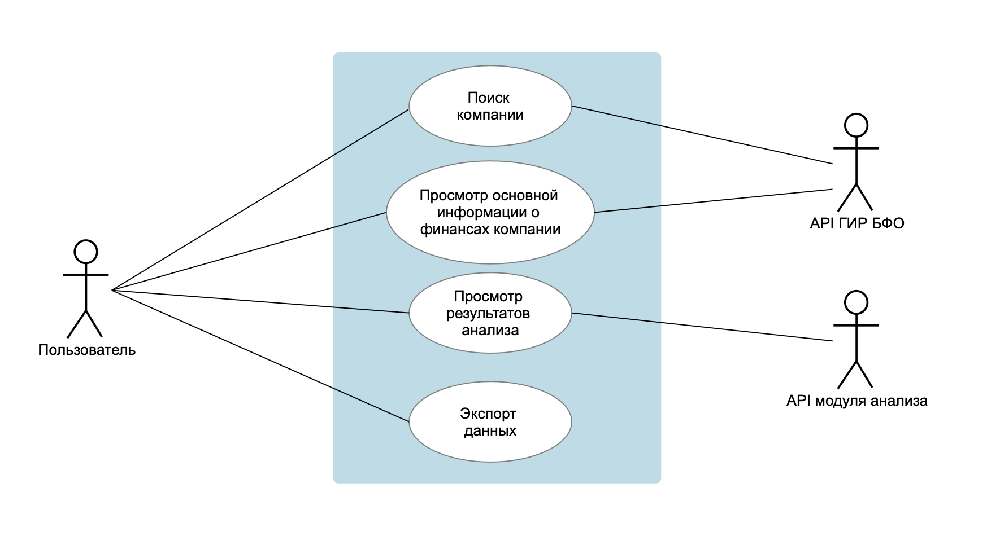

# Лабораторная работа 1

## Заинтересованные лица
<ul>
  <li>Пользователь(бухгалтеры, финансовые аналитики, инвесторы) 
    <b>Описание:</b> Основные пользователи данного сервиса, им необходима платформа с пользовательским интерфейсом, которая бы автоматизировала рутиный процесс и ускорила работу.
  </li>
</ul>

## Перечень функциональных требований

### Поиск компании:
<ul>
  <li>
    Пользователь должен иметь возможность искать финансовую отчетность компании по различным параметрам (наименование, инн, огрн, оквэд и т.д.)
  </li>
  <li>
    Пользователь должен иметь доступ к истории своих запросов
  </li>
  <li>
    Пользователь должен иметь возможность сохранять компанию в избранное, для быстрого доступа
  </li>
</ul>

### Просмотр фин отчетности:
<ul>
  <li>
    Пользователь должен получать основную информацию о финансах компании
  </li>
  <li>
    Пользователь должен иметь возможность экспортировать финансовую отчетность
  </li>
  <li>
    Система получает данную информацию посредством обращения к API
  </li>
</ul>

### Просмотр результатов анализа:
<ul>
  <li>
    Пользователь должен получать результат анализа финансовых данных на предмет экономической деятельности, платежеспособности и технологичности контрагентов
  </li>
  <li>
    Пользователь должен иметь возможность экспортировать результаты анализа
  </li>
  <li>
    Система должна сохранять результаты анализа в БД
  </li>
</ul>

## Диаграмма вариантов использования

## Перечень сделанных предположений
<ul>
  <li>
    Использовать БД для хранения результатов анализа компании, для того чтобы каждый раз не обращаться к модулю анализа.
  </li>
  <li>
    Создать кабинет пользователя, где хранить информацию о его работе(избранное, история поиска и т.д.). Это обеспечит надежность при проблемах с доступом к API ГИР БФО
  </li>
</ul>

## Нефункциональные требования
<ul>
  <li>
    <b>Надежность:</b> 
    Так как система взаимодействует с двумя внешними API, то при их отказе работа системы может встать, поэтому требуется продумать возможность ее работы и без данных API.
    Поэтому информация о проделанной работе (результаты анализа, результаты запросов и т. д.) должны храниться в БД.
  </li>
  <li>
    <b>Авторизируемость:</b> 
    Поможет сохранить функциональность системы при отказе внешних API. 
    В системе требуется личный кабинет пользователя, в котором можно было бы хранить информацию о результатах анализа выбранных компаний.
  </li>
  <li>
    <b>Совместимость:</b> 
    Система должна быть совместима с вненшними API, должны совпадать форматы запросов и ответов.
  </li>
  <li>
    <b>Сопровождаемость:</b> 
    Должно быть легко вносить изменения и улучшения в систему, так как проект на начальном уровне и в последствии он будет расширяться и развиваться.
  </li>
</ul>
